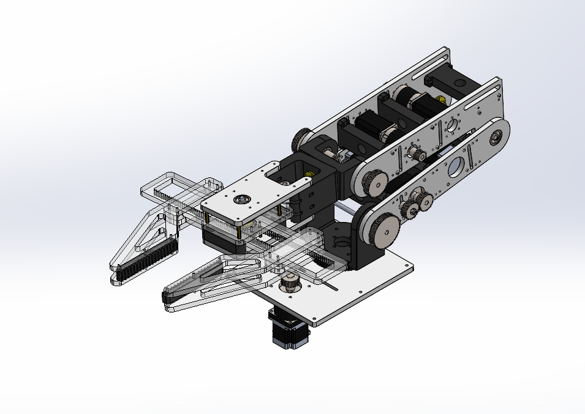
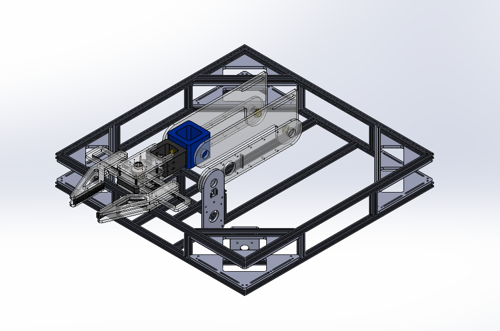
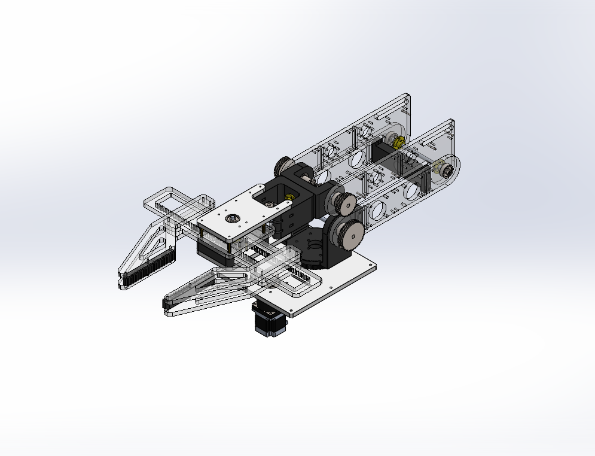

# ABU-Robot-2026-Robot-Arm-Mk3
A general-purpose robotic arm designed for use in robots competing in the ABU Robot 2026 competition.
## Preview

## Purpose

This is the third version of a 5-axis robotic manipulator designed to be mounted on the **R1 Mk3 AMR frame** for the ABU Robot competition. Its primary purpose is to relocate 1 kg cubes as part of the competition tasks.

The main design goal was to develop a robotic arm capable of carrying a relatively heavy payload at high speed while achieving a long reach. This would allow the robot to complete tasks as quickly as possible.

Through the development of the first and second versions, this third version represents the most refined design. It focuses on reducing vibration, increasing structural strength, and simplifying manufacturing. The main structural components are designed using Aluminum 6061 and ABS. Unlike the previous versions, which used acrylic for the structure, this version was designed to maintain the center of mass closer to the center of the robot.

Timing pulleys and belts were used instead of gears to reduce mechanical backlash and improve positioning accuracy.

Unfortunately, the project was discontinued before completion due to insufficient funding to register for the competition. The team subsequently decided to shift its focus to another competition.

## Features

* **5 degrees of freedom**
* **Maximum reach:** 1.2 m
* **Operating speed:** 90 RPM
* **Maximum payload:** 1.5 kg at maximum reach
## Design Evolution and Impovement
The Robot Arm MK3 was developed through three major design iterations. Each version was developed to address limitations identified during the previous design.

## Mk1

Mk1 was the first design iteration, featuring only 4 degrees of freedom and designed to be mounted on the R1 Gramar AMR frame. The main limitation was its inability to move the end effector horizontally without moving the entire robot frame. This reduced the robot's agility and made it slower when performing tasks.

## Mk2

Mk2 introduced a 5-axis configuration to provide greater freedom of movement and improve the arm's overall mobility. However, several problems were identified during the design and simulation process.

The acrylic structure experienced bending under load, reducing the structural rigidity of the arm. In addition, the placement of the stepper motors shifted the center of mass away from the center of the robot. This caused the robot to tilt or rotate slightly when viewed from the front during simulation.

The transmission system was also redesigned using timing pulleys and belts to minimize backlash and improve motion control.
## Mk3

Mk3 was the most refined version of the design. The structure was redesigned using Aluminum 6061 and ABS instead of acrylic to improve structural strength and simplify manufacturing.

The design also focused on improving the center-of-mass distribution, reducing vibration, and providing a more robust structure for high-speed operation and heavy payloads.

ABS was used for selected components where lower weight and easier manufacturing were beneficial. The placement of the major components was also adjusted to keep the center of mass closer to the center of the robot.

The joint transmission was redesigned using timing belts and pulleys to reduce backlash compared with the previous gear-based system.